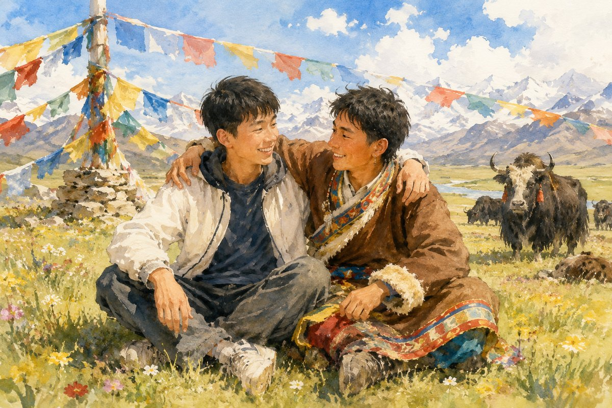

**作者：李江**

爱上西藏阿里，绝不是因为她那诱人的风景。

那年，因为军队调整改革，我跟随部队来到了阿里。车队一路翻山越岭，映入眼帘的是岩石与积雪堆叠而成的峰峦，风起云涌，苍茫如海。缠绕交织的河流从山间奔流而下，叮叮当当响彻大地。

那时，正值初夏，家乡到处是花红柳绿的景象。而这里，仿佛被时间遗忘，所有的一切都还定格在冬天。

由于我是第一次上高原，车队翻越界山达坂时，我就出现强烈的高原反应，即便张着嘴大口喘气，胸口仍然憋得难受。好不容易下了达坂，战友们围坐在一起休息，却没有一个人愿意开口说话。

指导员见状就在我们身边坐下，向大家讲起了当年进藏先遣连的故事："1950年8月1日，先遣连在党代表、总指挥李狄三的率领下，从新疆于田县普鲁村出发。那时候，他们来不及准备防雪、防高寒的装备，仅靠一腔热血、几件普通的棉军衣，就踏上了跨越昆仑山脉的漫漫征途。1950年年底，先遣连在翻越界山达坂时，被漫天风雪和高山天堑阻断了与后方的联系，给养补给彻底中断，不少官兵患上了高原病。那时，队伍在雪里休息，集合的时候，很多人没能再次站起来。可剩下的人依旧在战旗下，整齐列队……"

指导员说着说着，眼眶渐渐湿润了。听到这里，我的内心受到了强烈的震撼，眼前仿佛出现了这样一幅画面：一支队伍高高举起鲜红的战旗，在风雪中向前挺进……

我默默起身，凝视着远方连绵起伏的山峦，恍然觉得，高峻巍峨的雪峰正昂起头颅，向那支英雄的队伍行了一个军礼！

这时，不知哪个战友突然喊了句："咱们可不能给先遣连的英雄们丢脸啊！"身边的战友闻声纷纷起身，不顾高原反应带来的身体不适，开始检修车辆，准备重新出发。浩荡长风从山谷里吹来，车队起程，一座又一座的雪山被车辆甩在了后头。

在阿里这片广袤而苍凉的土地上，每一寸风沙都镌刻着历史的痕迹，每一缕寒风都诉说着先辈的坚韧与无畏。我们的车队在高原上蜿蜒前行，车轮碾过冰雪覆盖的道路，发出咯吱咯吱的声响，仿佛在回应这片土地的呼唤。

远处的雪山在阳光下闪烁着银色的光芒。车辆行驶的速度逐渐加快，引擎的轰鸣声与风声交织在一起。随着海拔升高，空气也越来越稀薄，呼吸变得困难，但我们的心却愈发坚定。每一次呼吸，都像是在与这片土地进行一场无声的对话；每一次前行，都像是在向那些曾经在这里战斗过的英雄们致敬。

终于，在几天后，我们的车队到达了驻训点。抬眼望去，蓝天如洗、白云低垂，仿佛触手可及。阳光洒在雪地上，反射出耀眼的光芒，好像在为我们的到来而欢呼。战友们相视一笑，眼中满是自豪与欣慰。这一刻，我们不仅征服了高原的险峻，更征服了内心的恐惧与犹豫。这是一次心灵的洗礼，更是一次精神的升华。在这片土地上，我们感受到了自然的伟力，也感受到了先辈们的无畏。而我们，也在先辈们的指引下，带着这份坚韧与勇敢，开始书写属于我们的故事。

驻训开始后，我们按计划训练、执勤，当然还有很重要的一项工作就是到驻地藏族同胞家中走访慰问。那天，是我第一次跟随单位前往驻地共建村。还没等我们到村子里，村民们就已经早早地等候在村口了。他们张望着我们来时的路，叫不出我们的名字，只能大声地喊着对我们最亲切的称呼"金珠玛米"。

村民们伸直了胳膊争相和我们握手，笑着竖起大拇指。那一刻，我打心眼儿里为自己是一名解放军战士而感到自豪。

进村后，我跟随分队前往村民家中赠送慰问物资，走进一户人家后，家里年迈的藏族阿妈热情地从屋里端出了糌粑、酥油茶、牛肉干塞到我们手里，见我们不肯收，她眼里涌出泪水，嘴里不停地重复着一句话。经过团里随行的藏族班长翻译后，我才知道，老阿妈说的是："我的儿子跟你们一样，也是解放军。"

看着老阿妈着急的样子，我们都知道老阿妈是想她的儿子了，为了让老阿妈心安，同行的领导接过老阿妈手里的牛肉干，当着老阿妈的面一点点撕开分给了我们后，对老阿妈说："我们就是您的孩子啊！"

那是我记忆中最好吃的牛肉干，我看到了老阿妈见我们吃下牛肉干后露出的笑脸，体会到了军民鱼水的深厚情谊，感受到了人民子弟兵这几个字的分量。

慰问活动结束后，村民们又自发地前来为我们送行。几公里的路程，他们跟着大巴车走了一程又一程。坐在大巴车里，我不知道该用什么样的词汇来形容这群干净纯粹、如同山间雪水一般清澈的村民。

时光荏苒，转眼间，我已经在这里整整驻守五年时间了。如果说，爱上西藏阿里需要一个理由的话，那么我想，应该就是那些高耸的山和那群可爱的人吧。
