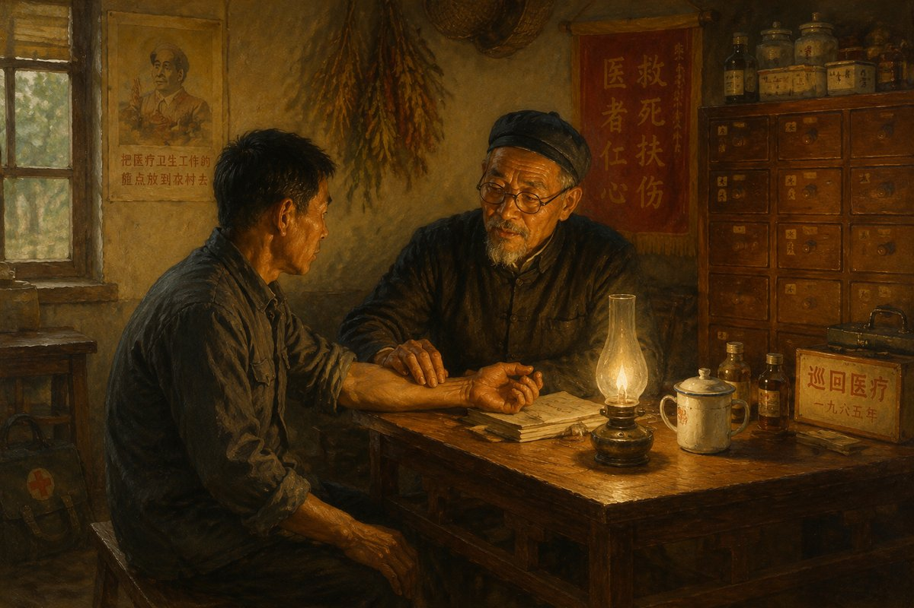

**作者：马作辉**

清晨，三月的太原天空中飘着丝丝细雨。清明敬天祭祖、缅怀先人的时节快要到了。我站在家中的阳台上，怀着虔诚的心情，不由地向东方眺望：我仿佛看到了太行山那边父亲在世时的正定老家，看到了已故父亲那慈祥的面容，不禁引发了我对他无尽的追思和回忆。

父亲是一个受人尊敬、德高望重的乡村医生，是一个16岁就入党的"三八"式共产党员，是一个受县、地两级表彰的"劳动模范"。

公元1976年4月27日，父亲因病医治无效，永远离开了我们。那年他才54岁。父亲的去世，给我们心里留下了无尽的悲痛和遗憾。每思及此，我不禁潸然泪下。

父亲是因长期的劳累，积劳成疾，造成肝功能受损，恶变肝硬化，致上消化道第二次大出血而去世的。他第一次大出血，发生在三个月前一个寒冷的深夜，经紧急送医院抢救脱离危险。彼时，部队面临百万大裁军之精简整编任务，停止了一切探亲休假。因此，我未能回家看望父亲。

父亲去世的那天，是部队完成精简整编，我被留队后批准探家，到家后的第二天。

莫非父亲就是在等我回来见最后一面？我清楚的记得，父亲见到我，异常的兴奋和喜悦，话说的很多，夜里也长谈至晚。

父亲对我说，在他大出血紧急送往医院那个寒冷的深夜，村里有37位青壮年听说后，闻声而动，自发地不顾夜深天寒路远，骑车60余里，赶到石家庄省第二人民医院去看望他，并为他献血，使他极为感动。

父亲说："今后只要我能爬起来，只要我有一口气，就还要好好为乡亲们看病服务，以报答大家对我的救助之恩。"这是父亲面对自己的儿子，所发出的肺腑之言，令我敬佩，令我动容，令我感奋！

在和父亲交谈中，看的出他对我在部队的表现，很是满意。我告诉父亲，部队精简整编强调"编制就是法规"，因团里没有战士报道员编制，所以我已离开机关，回到连队继续当班长。父亲说："还是那句话：不管干什么，不管到什么时候、在什么情况下，都要'重德守正，发愤图强，做一个对党对国家对人民有用的人'"。使我没想到的是，这竟成了父亲对我最后的嘱咐，与我最后的诀别，使我痛彻心扉，泪如雨下。

父亲于1922年11月，出生在一个贫苦农民家庭。爷爷奶奶一生共育有四男四女8个孩子，父亲最长。奶奶说我父亲从小就懂事，他喜欢读书，乐于助人，很惹人喜欢。

当一名民间医生，为民医治疾患，是父亲从小的志愿。经人介绍，他从15岁起，就到获鹿县大河镇的一个中医世家拜师学医。

父亲说，学医可不那么容易。中华医学强调的是德医双修：先修德，后为学，再施术。看病用药讲究的是"修合无人见，存心有天知"。就是要求医者要有仁爱之心，要诚实守信。

父亲说，他在那学医时，老师对学生的要求很严，立有"三不教"的规矩，即品德不好不教，性格不好不教，悟性不好不教。为了考察和识别学生，先让干打水扫地、端茶倒水、清茅厕、倒夜壶、劈柴等一些杂活，考察期长达一年之久。

听奶奶说，我父亲在那儿学徒时，是老师遇到的最好的学生之一，所以老师也就诚心诚意教他，他也很努力，学业完成很好。

父亲学成后，回到村里跟随老一辈看病先生，一起开诊所。由于他有文化，学的扎实，看病认真，进步很快，至解放初期，已小有名气。

父亲于1958年，被选派到我县西北片区医疗卫生中心当主任，至1964年医疗卫生机构调整，不再设立那个中心时，父亲又回到村里，当医疗保健站站长，直到去世。

我打记事起，父亲就从来没时间陪伴过我们。

上世纪50年代末至60年代初，父亲当主任的那个设在一个叫丰家庄村的医疗卫生中心，包括父亲在内，也就只有几个医生。由于医生少、病号多、工作忙，父亲连回家的时间都很少，更别提陪伴我们小孩了。

后来听叔叔们说，父亲在那儿工作时，对人好，医术高，找他看病的人很多，有人还写了他《雨夜出诊》《患者的贴心人》《精益求精》等文章，登在河北日报上，宣扬他的事迹。

父亲中等偏上的个头儿，身材匀称，一辈子都剃个光头。夏天常穿件白衬衣，将上衣下摆扎在裤腰内，冬天常穿一件黑色半大衣，头戴一顶栽绒帽，多少年不变样。他无论是穿新衣还是穿旧服，总是整整齐齐、干干净净，一看就是个文明先生模样。

父亲可能是因身心过于劳累，40来岁脸上就布满了皱纹。父亲慈眉善目，面容和蔼，性格开朗，与他接触或相处，总给人一种亲近感和贴心感，因而受到人们的尊敬和信赖。

记得在我十来岁时，一次父亲骑车带我进城，返回时要穿过东叩村、中叩村两个村子，才能回到我家所在的西叩村。

当进到这两村时，就骑不成车子了，只能步行。因为认识父亲的人多，不停地有人和父亲打招呼：有喊"马医生"的，有喊"马先生"的，有喊"马主任"的。父亲也边推着车子，边向人家问好，相互间显得十分亲热。我第一次亲身感受到人们对父亲的尊敬，和父亲平易近人密切联系群众的魅力。彼此间那份真诚和热情，不是能够装出来的，给我留下了深刻印象。

不仅如此，当我俩走到中叩村时，一个约有50来岁的长者，边和父亲打招呼，边走到父亲跟前说，他这段时间身体不好，正想着哪天找父亲去看病。父亲闻言立刻支好车子，说："来！让我看看。"说着就让那人把手放在自行车的座子上，号起脉来。边号脉边问病情，而后从口袋里拿出处方签，给他开了药方，并嘱咐了注意事项，那人很是高兴，一个劲儿地道谢。

村里的人们看到父亲当街看病，就小声议论起来。有的说："人家马先生就是强，看病认真，待人实诚。"有个人还说："我叔叔的病，看了好长时间也不见好，还是找人家马先生给看好的。"听到这些，我真为父亲感到骄傲和自豪。

就这样，我俩本来骑车不到10分钟的路，却用了将近1个小时。

父亲之所以受人尊敬和信赖，最根本的原因是，他胸有病人、心想患者，总把病人当亲人。

我看到父亲给人看病，无论对谁，无论在什么情况下，他总是亲切接待，热情服务。他说话和气，态度诚恳；询问病情祥细，解答询问耐心；善于用心理学的有关道理，化解患者心中的疑惑、顾虑和担忧，从而实现医患紧密配合，提高治疗效果。就连他开出的药方，也是书写工整，字迹清晰，从不了草从事。

父亲经常说的一句口头禅是：作为一名乡村医生，就必须要有"甘当一头小毛驴"的精神。出诊，是乡村医生一个经常性工作，面对千家万户的许多老弱病残和重症患者，医生只有出诊才能对他们实施救治。所以，需要出诊时医生不能讲价钱、打折扣，就像"小毛驴"一样，让人"牵上就走"。

父亲不仅这样教育年轻医生，更是以身作则，身体力行，而成为榜样和楷模。

在我记忆里，父亲夜间出诊，是司空见惯之事。不管刮风下雨、天寒地冻，他都克服困难为人治病服务。有时他身体不舒服，甚至一个晚上接连出诊，也在所不辞。

我们的村子大、人口多，病号多，医生很忙。人们为了便于找到父亲，于是就趁吃饭时间找到家里，从而形成了夏天开饭时，人们在院子里等；冬天吃饭时，人们到屋里等，已经习以为常。

看到父亲经常吃不好、睡不好，母亲很是担心父亲的身体，有时就说他："你真是不要命了？你就不会推一推、躲一躲？别说是人了，就是个机器也总不能一个劲儿地转吧？况且你的身体还不好！"然而，在父亲的字典里，从来找不到"推脱"二字。他那"俯首甘为孺子牛"的"小毛驴精神"，始终如一，从不懈怠，令人钦佩。

父亲就是这样，他关心别人比关心自己为重。在他眼里，自己的事儿再大也是小事儿，唯有治病救人才是大事。

那是1963年8月初，一场大雨下了七天七夜，整个河北发生了严重的洪涝灾害，我家房子的后墙被泡塌了。几个叔叔拿来立木、木板，将后墙屋顶支撑起来后，需要父亲安排全家到哪儿去住的问题，然而此时父亲却不见了。当时我们还小，母亲刚生下三弟不久，不便下床活动。当发现他的药包不在时，知道他去出诊了。我们在风雨交加、没有后墙的屋里，蜷缩在炕上焦急地等他回来，结果直到半夜，他才弄得满身是水地回到家里。母亲也不知该埋怨他，还是该心疼他……

父亲给人看病用的是真心，下的是真功夫。1971年，我的一个在街坊上称我父亲为大哥的女同学，得了严重的紫癜病，导致肾功能障碍。为了治病，她跑遍了石家庄市的大小医院，均不予收治。拿她的话说："就等于给我判了死刑。"回来后，经我父亲认真诊断，详细做出以中医为主的治疗方案，并定期回访，适时调整中药配方，经过近一年的治疗，得以痊愈。每当提及此事，她都激动的含着眼泪说："是我那好大哥给我捡回了一条命！"

父亲之所以受人尊敬和信赖，还因为他是一个出了名的有口皆碑的好人、善人。

父亲经常说的一句口头禅是："见好事就办"。其含义是，当你看见有人需要你帮助或需要你解决问题的时候，就要积极地去做，主动地去办。就是要多做好人好事。

从我记事起，我家西厢房就住着一个老太太。母亲让我叫她奶奶，开始我不知就里。长大了才知道，她家因人多房少，加上家庭情况复杂，她无房可住。父亲知到后，与母亲商量，就把我家西厢房腾出来，让她无偿住用，一住就达10年之久。两家合睦相处，一时传为佳话。

我多次看到，父亲在街上看到有谁穿的鞋子和衣服破旧不堪时，他就把人领到家里，让母亲挑一些还能穿的鞋子和衣服送给人家。特别是对从小失去母亲，且智力不够健全的两兄弟，经常予以关照。

父亲非常热爱和关心集体。上世纪60年代后半期，父亲建议并支持生产队发展集体副业经济，并让生产队无偿使用我家院子和新建房屋，筹建了香油磨坊和木工作坊，推动了集体经济的发展。

父亲还善于热心帮助和解决乡邻之间、有的家庭成员之间所发生的一些问题和矛盾纠纷。

一次，我看到有俩人在大街上吵了起来。公说公有理，婆说婆有理，互不相让，招了不少人围观。吵了一会儿后，突然一方说："不行，我俩就找马先生给评评理去！"另一方说："评评理就评评理！看你对还是我对！"

遇到乡邻之间这种闹矛盾、闹纠纷的事，父亲总是热心地本着从团结的愿望出发，耐心地讲道理，诚恳地做说服劝和工作，直到双方心悦诚服、握手言和。

按说，父亲是不该过早离开我们的。如果他也注意关心自己，注意保养，注意休息，避免劳累，他的身体也不至于有什么大碍。然而恰恰相反，他干起工作来总是有那么一种拼命精神和自我牺牲精神。

说来那是1966年7月，县里为落实毛主席1965年"6·26"批示中指出的"广大的农民得不到医疗，一无医，二无药"，"应该把医疗卫生工作的重点放到农村去！""培养一大批农村也养得起的医生，由他们来为农民看病服务"的号召，在全县统一计划下，决定在县西北片五个公社中，选拔60名有培养前途的年轻医生，用半年时间，在正定五中进行集中培训。

为此，上级领导经认真研究决定，把此项任务交给父亲一人完成。父亲愉快地接受了任务。然而，在半年内要他一人来完成60名新医生业务强化培训，其任务之重，工作量之大，身心付出之艰巨，可想而知。

集训中，父亲既搞教学，又抓管理，还管保障；与学员同吃、同住、同上课、同劳动；夜里加班备课，白天抓紧教学，可以说是夜以继日地超负荷运转。随着父亲培训任务的圆满完成，也使他透支了的身体付出了沉重的代价。

我清楚的记得，在距1967年春节不到一个月时间的那天，我和母亲正在院子里收拾家务，突然看到父亲推着自行车回来，车上载着他的行李和生活用品。只见他停下车子，也顾不上和我们说话，便急急忙忙从院子里捡起三块砖头，成三角形摆在院子的一角，拿出他带回来的中药和一个砂锅，要在这院子里熬药了。

我和母亲见状大为惊恐：父亲的身体明显消瘦，憔悴的面容晦暗中带着疲惫，和他走时已判若两人。我和母亲惊讶的一时目瞪口呆。当我和母亲回过神来，赶紧给父亲做了熬药的准备。

父亲病成了这个样子，我和母亲心疼的难以形容。我边熬药边想得很多很多，顿感一种可怕的危机已向我袭来：假如父亲有个三长两短……我不敢往下想了，因为我还不满十四岁，除姐姐外我下边还有一个小我两岁的妹妹、两个才几岁的弟弟，母亲身体也不好，家庭的重担无疑将落在我那还嫩的肩上。我的心里沉甸甸的。

使我没想到的是，父亲此时并没有急着进屋休息，他拿起一个小板凳，接过母亲递给的热水杯子，坐在我身旁，边看我熬药，边努着力笑了下说："是不是我把你们吓着了？今天培训结束，事情比较多，确实很累，没大事儿，休息一段儿就好了，不要为我着急！"

我抬起一直低着的头，用疑惑的眼睛看着他。

父亲喝了口水说："这次接受新医生培训任务，是我自愿的，没人强迫我。我这辈子没别的本事，就是学了个医。就像军队一样，养兵千日用兵一时，在该用你的时候，不能当逃兵。虽然很累，很费心，但我心里高兴，因为做的是一件有意义的好事、善事。"他停了一下，接着说："人不能总为自己着想，如果那样人生就没有意义。就拿我们这个近五千人口的大村来说，人多医少，又远离城里的医院，人们病了总要有个依靠。"

父亲的话，就像打开了一个堵在我心口的闸门，眼泪夺眶而出。我擦了下泪水对父亲说："你赶紧进屋歇着吧！药熬好了我端过去。"

父亲回屋后，我边熬药边回味父亲的话：他已经病成这样了，还全然不顾自己，仍然想的是他热爱的事业和人民。父亲就像一支火红的蜡烛，燃烧自己，照亮别人！

虽然我那时还小，父亲的思想境界和大公无私的品格，无疑是对我心灵的一次敲击和锤锻。

父亲生病的消息，人们很快都知道了。除县卫生局、地段医院，公社和村的领导前来看望慰问外，一般病号为让父亲安心养病，便不再来打扰。尽管如此，也还是有上门求医者，每遇此种情形，父亲总是嘱咐母亲说，千万不要把人家挡在门外！

父亲在自己的调理和母亲的照料下，病情开始好转起来。但从1967年至1976年10年时间里，他的身体在时好时坏的情况下，给人看病服务从未间断过，直到病魔夺去他宝贵的生命。

办完了父亲的丧事，我们都想找到父亲的照片作为留念。但遗憾的是，父亲这一生竟没有留下一张照片。

然而凑巧的是，此时来了一位街坊上的叔叔，他见我们正为找不到父亲的照片而发愁，就大着嗓门说："嗨！县文化馆展览橱窗里，就有他当劳模的大照片，我昨天进城时看到的。"全家闻言，面露惊喜。

次日，我和妻子、我当时的未婚妻骑车进城。当我俩行到县文化馆展览橱窗前，展板上一行"正定县劳动模范人物简介"通栏标题下面，展出了"劳模"们的照片和简要事迹。其中父亲的那张大照片，赫然映入眼帘：父亲正用他那慈祥的眼神看着我们。他依然穿的是那件黑色半大衣，还是戴着那顶栽绒帽。

照片下面的文字写着：马兰柱，曲阳桥公社西叩村人，1922年11月出生，1938年加入中国共产党，西叩村医疗保健站站长……

望着父亲那亲切的面孔，看着对父亲模范事迹的介绍，犹如眼前矗立起一座丰碑，令人肃然起敬，我俩的眼泪止不住地流了下来。

啊！父亲，我心中的丰碑！

悬壶济世医苍生，长留肝胆照后人。父亲，您那高尚的品德和高贵的人格，永远值得我们学习、敬仰！
