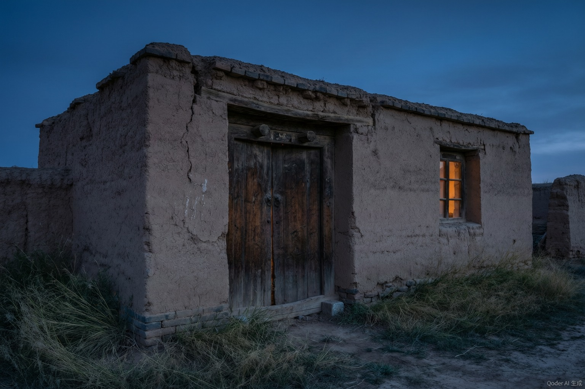

我走的时候，我还不懂得怜惜曾经拥有的事物，我们随便把一堵院墙推倒，砍掉那些树，拆毁圈棚和炉灶，我们不清楚它们对我们多么重要。这些东西一旦消失，我们才发现生活中留下一个巨大的空洞。多少年来我总想回到那个被我随便弄坏的院子里，回到那堵被我推倒的院墙前，把那些我砍掉的树再栽上，把那些拆掉的圈棚和炉灶再原样修好。我多想回到那些熟悉的事物中间，可我知道它们早已面目全非。

这些都是我今生今世的证据啊。

我走的时候，我还不知道曾经的生活有一天，会需要证明。

有一天会再没有人能够相信过去。我也会对以往的一切产生怀疑。那是我曾有过的生活吗。我真看见过地深处的大风？更黑，更猛，朝着与我相反的方向，刮走人的骨头和衣服。那些漫长的冬夜，有一匹马在村子边的荒野上站了一夜，天亮时浑身结满冰霜，像一件白色的铠甲套在马身上。我真沐浴过那样一场一场的月光？那些安静而透彻的照耀，把荒野上每一棵树每一棵草都照得无比清晰。

现在，谁还能说出一棵草、一根木头的全部真实。谁会看见一场一场的风吹旧墙、刮破窗，把一样东西一件件从我们手中拿走，再不归还。谁还能说出我们经历过的任何一个白天和夜晚的全部细节。我们走了，留下这些空洞的房屋和院子。所有我们生活过的证据都将随风飘逝。风把一切吹远。一个人内心的生存谁又能见证。

这一切，难道不是一场一场的梦。我把多少年的生活留在身后的那个村庄里。那些我熟悉的院墙、房子、树木、花草，那些我走过的路和踩过的脚印。我把多少亲人的笑声和哭泣留在那些年里。当我离开它们的时候，我并不知道那些平常的日子，会成为我一生中最珍贵的记忆。那时我就知道一个土坑漫长等待的是什么。

但我却不知道这一切面目全非、行将消失时，这些被废弃的院墙和房子，它们是否变得毫无意义。对于今天的生活，它们是否变得毫无意义。一个废弃的村庄，对于生活在那里面的人和牲畜来说，是不是已经结束了。那些空了的房子，是不是已经不需要再为谁遮风挡雨。那些废弃的院子，是不是再也不会有人在里面走动和生活。

我回到曾经是我的现在已成别人的村庄。只几十年功夫，它变成另一个样子。尽管我早知道它会变成这样——在那些年里，我已经知道一切都将面目全非。那些院子里的树已经长得很粗了，那堵被推倒的院墙旁又砌起了新墙。那些旧房子有的已经塌了，有的换了新主人。我站在村头，看见那些我熟悉的人和牲畜全都不在了。取而代之的是另一些陌生面孔。

那时我才知道，一个人的生活是可以被完全抹去的。当所有的证据都消失以后，我拿什么来证明我曾经在这里生活过。当家园废失，我知道所有回家的脚步都已踏踏实实地迈上了虚无之途。

---

> 注：本文从多个网络公开来源拼合整理，可能不完整，原文收录于散文集《一个人的村庄》（苏教版高中语文必修一课文）。如需阅读完整版，建议查阅正版教材或购买原著。
