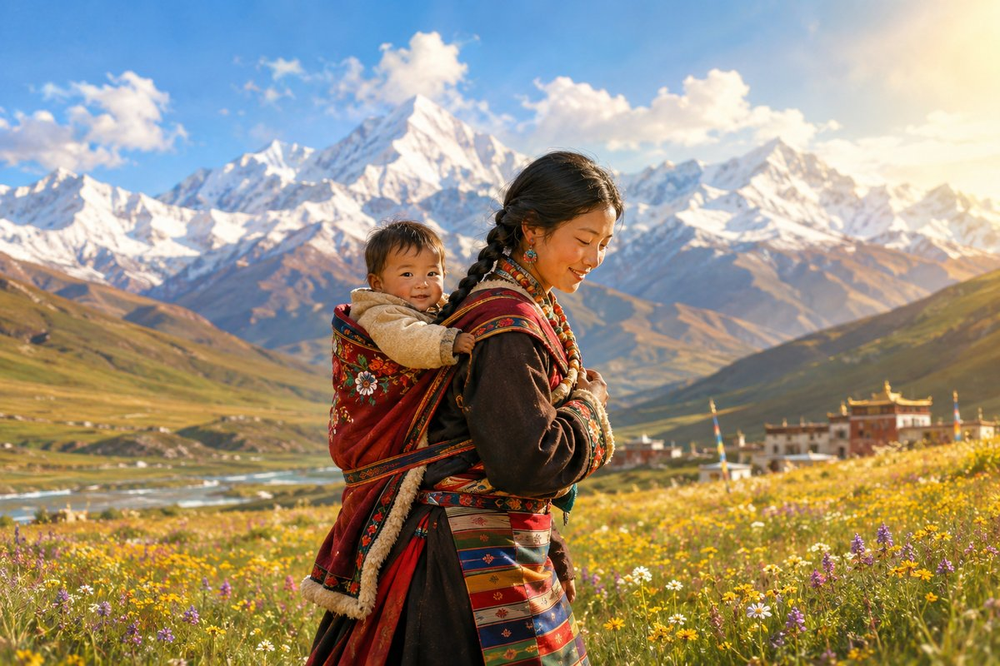

**作者：史传统**

海拔五千米的垭口，凛冽的寒风如利刃般割着每一寸裸露的肌肤，稀薄的空气仿佛被一只无形的大手紧紧攥住，每一次呼吸都伴随着胸腔的剧烈起伏。我拖着沉重得如同灌了铅般的步伐，艰难地挪动着，每一步都似乎踏在了历史的尘埃之上，那尘埃里沉淀着无数朝圣者的汗水、泪水与虔诚的祈愿。

我的登山靴突然陷入了一道深深的沟壑，那沟壑宛如大地被岁月刻下的一道伤痕，又似一条沉默而坚定的河流，承载着朝圣者用千年光阴凿出的等身长头印记。沟壑里，深浅不一的凹痕纵横交错，宛如大地的脉络，每一道都诉说着一个关于信仰与坚持的故事。清冽的雪水在凹痕中汪着，倒映着经幡的残片与神鹰的掠影，那经幡残片上的经文在波光中若隐若现，仿佛是大地裂开的偈语，向世人诉说着无尽的虔诚与坚韧。

站在这条沟壑旁，心中涌动着难以言喻的震撼。那一个个凹痕，是朝圣者用额头与大地无数次亲密接触留下的印记，是他们用身体丈量信仰的见证。

就在这时，一个身影缓缓进入我的视线。她是一位藏族女子，名叫卓玛，正以一种近乎虔诚到极致的姿态，用额头丈量着大地。每一次俯身，她的身体都与大地紧紧贴合，那"嘭"的一声闷响，仿佛是她对信仰最深沉的致敬。她的藏袍后背结着厚厚的汗碱结晶，在阳光下闪烁着细碎的光芒，宛如夜空中散落的星辰。发辫散乱地沾着糌粑屑，随着她的动作轻轻晃动，宛如一尊移动的曼陀罗，散发着质朴而神圣的气息。她的脸庞被高原的阳光晒得黝黑，布满了岁月的痕迹，但那一双眼睛却明亮而坚定，仿佛燃烧着永不熄灭的信仰之火。

我递给她一支能量胶，试图为她补充一些体力。然而，她却用缺了门牙的豁口漏进风声，声音虽弱却坚定无比："圣山不在这张地图里，它在磕破的额头中央。"

这句话如同一道闪电，瞬间击中了我的心灵。我恍然大悟，原来真正的圣山，并不在于地理坐标所标注的位置，而在于朝圣者心中那份对信仰的虔诚与坚持。那磕破的额头，是他们与圣山最亲密的接触，是他们灵魂与信仰交融的见证。

跟着卓玛的脚步，我闯入了朝圣者编织的河流。这是一条由信仰铸就的河流，每一个朝圣者都是这河流中的一滴水，汇聚成了这磅礴而壮丽的景象。

老人们拄着经杖，步履蹒跚却坚定无比，他们的身体或许已经不再矫健，但他们的信仰却如磐石般坚定不移。每一步的挪动，都伴随着经杖与地面的碰撞声，那声音仿佛是岁月的鼓点，敲打着时光的长河。

年轻人推着载有卧病亲属的手推车，眼中闪烁着对亲人的关爱与对信仰的执着。他们的脸上写满了疲惫，但那份坚定却从未动摇。他们知道，在这条朝圣之路上，每一步都充满了艰辛，但为了亲人的康复，为了心中的信仰，他们愿意付出一切。

孩童们抱着与身体等高的转经筒，稚嫩的脸庞上写满了对未来的憧憬与对信仰的敬畏。他们的小手紧紧握着转经筒，用力地转动着，那清脆的转动声仿佛是他们对未来的美好期许。他们的身影在朝圣的队伍中显得格外渺小，但他们的信仰却如同初升的太阳，充满了无限的力量。

他们的影子被夕阳拉得很长，在玛尼堆上重叠成流动的六字真言。那六字真言仿佛有了生命，在大地上缓缓流淌，每一寸土地都在诵唱着对佛祖的赞歌。玛尼堆上的石块大小不一，形状各异，但每一块都承载着朝圣者的祈愿与祝福。它们静静地矗立在那里，见证着岁月的变迁，守护着朝圣者的信仰。

在这条河流中，我见到了一位红衣少女。她突然停下脚步，从怀里掏出一面风马旗，那风马旗的颜色鲜艳夺目，在微风中轻轻飘动。她轻轻地系在牦牛角上，动作轻柔而虔诚。铜铃摇响的刹那，整座山峦都在共鸣，仿佛大自然也在为这份虔诚而喝彩。那清脆的铃声在山谷间回荡，仿佛是神灵的召唤，引领着朝圣者走向心中的圣地。

我看着那面风马旗在风中猎猎作响，心中涌起一股莫名的感动。我知道，这不仅仅是一面旗帜，更是朝圣者心中对信仰的坚守与传承。风马旗上的经文和图案，蕴含着深厚的宗教文化内涵，它们随着风的吹拂，将朝圣者的祈愿传递到每一个角落。

卓玛用三块石头垒起了简易的灶台。那三块石头仿佛是大自然赋予她的礼物，稳稳地支撑着灶台。牛粪饼在火中爆裂，溅起星子般的火星，照亮了周围的黑暗。那温暖的火光，驱散了夜晚的寒冷，也照亮了我们的心灵。她往茶碗里撒着酥油，一边搅拌一边对我说："每个朝圣者都是行走的玛尼堆。身体是转经筒，心跳是诵经声。"

火光在她脸上投下跳动的阴影，我突然看清了她掌心的茧——那是常年握转经筒磨出的年轮，记录着比树轮更密集的时光。那厚厚的茧，是她对信仰执着追求的见证，是她用岁月和汗水书写的信仰篇章。

那一刻，我深深地感受到了朝圣者的伟大与坚韧。

月光浸透纳木错的那个凌晨，我们赤脚走进了刺骨的湖水。湖水冰冷刺骨，仿佛能穿透骨髓，但我们的心中却充满了虔诚与敬畏。远处有朝圣者全身浸入湖中，仅留发辫漂浮在水面上，宛如水葬的绿度母，散发着一种超凡脱俗的气息。他们的身影在月光下显得格外圣洁，仿佛与湖水融为一体，成为了大自然的一部分。

卓玛突然捧起湖水饮下，眼中闪烁着虔诚的光芒："这是观世音菩萨的眼泪。"她的藏袍在月光下泛着幽蓝的光泽，与湖水共呼吸，仿佛与大自然融为了一体。

那一刻，我仿佛也被这份虔诚所感染，心中涌起一股莫名的冲动。我也想像卓玛一样，捧起这圣洁的湖水饮下，让心灵得到一次彻底的洗礼。然而，我知道自己还无法达到那种境界，我只能默默地站在一旁，感受着这份神圣与庄严。

下山那日，我在等身长头沟旁堆起了一堆玛尼石。这些石头虽然普通无奇，但它们却承载着朝圣者的信仰与坚持。我精心挑选着每一块石头，将它们一块一块地垒起来，仿佛在堆砌着自己心中的信仰之塔。

卓玛留下了一串串着绿松石的哈达，轻声对我说："石头记得所有额头的温度。"

这句话让我心中涌起一股暖流，我知道这些石头不仅仅是一块块普通的石头，它们更是朝圣者心中对信仰的见证与传承。每一块石头都承载着一个朝圣者的故事，每一道纹路都记录着他们的虔诚与坚韧。

在返回的路上，我遇见了背氧气瓶的旅人。他们指着我沾满糌粑的裤腿惊呼："你也去朝圣了？"我微笑着点了点头，心中充满了自豪与满足。我知道自己虽然只走了一段短暂的朝圣之路，但这段经历却让我收获了无尽的感悟与成长。

我望着云层中若隐若现的冈仁波齐，心中涌起一股莫名的感动。那雄伟的山峰，宛如一座神圣的殿堂，矗立在天地之间。我突然明白了一个道理：真正的朝圣之路不在藏地，而在磕向大地的瞬间。当我们学会用身体丈量信仰，每一个脚印都会长出玛尼堆，每一滴汗水都会凝结成经幡。

这条朝圣之路虽然艰难无比，但它却能让我们找到内心的宁静与力量，让我们在纷扰的世界中找到一片属于自己的净土。
