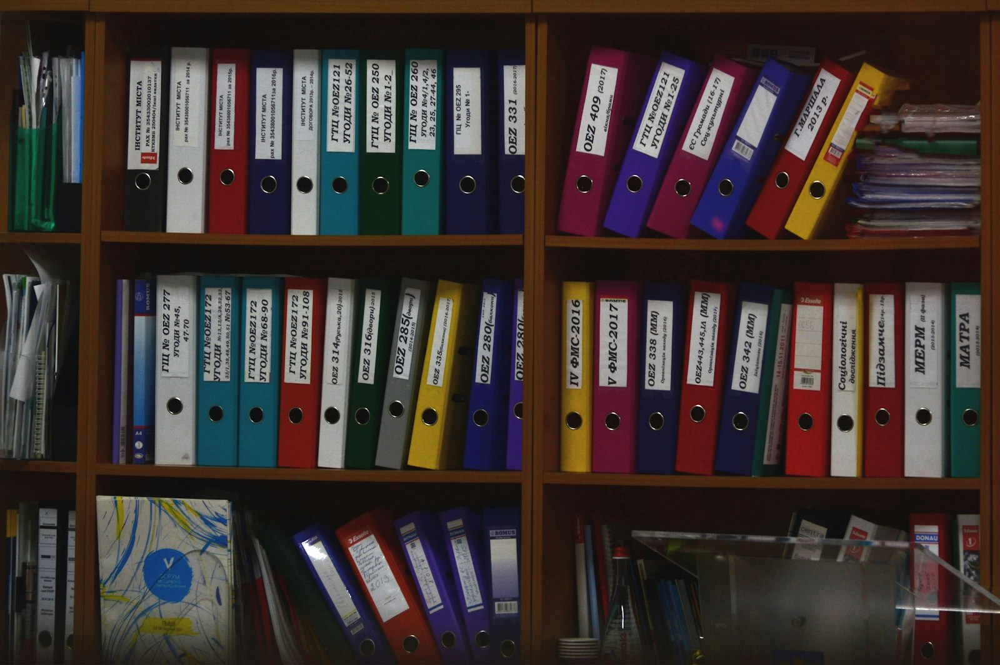

最近来找我交流的孩纸比较多，大多都是让我介绍康藏文化，由于这个命题实在太大，我只能用主要的一面来做笼统的介绍。至于家乡的"民风彪悍"，我不想多说，就连队长这么热爱和平的人都经历无数次斗殴，所以想到战斗可能才是康巴文化的精髓，就以此为大家做介绍吧。

**他们虔诚的信着佛教，也准备随时抽刀子杀人**

1943年，德国人海因里希·哈勒刚到西藏的时候就被康巴土匪抓住了，由于没有钱，差点被鸡奸，但是他凭着惊人的智慧说动了土匪，告诉他们自己菊花很松，劝他们放下手中的酥油，最后奇迹般的逃到了拉萨。

直到1945年，海因里希在了解了康巴藏区后在他的日记里写下了对康巴人的评价："他们虔诚的信着佛教也准备随时抽刀子杀人。"

**藏北的强盗文化**

藏北，中国的西伯利亚，以前这里生活的康巴人如果单靠种植农作物与放牧，百分之百要被饿死的，所以打家劫舍是康巴人必备的技能。只有在这种地方，强盗是受人赞扬的，所以这里最流行的歌曲不是《仓央嘉措情歌》，而是《强盗歌》。

他们歧视农奴，毫不同情弱者，途经康区的外地商队经常菊花不保。而四川康区的土司们相当善良，他们开疆扩土，种植鸦片，贩卖烟土，然后得来的钱捐给寺院或资助苦行僧，这种自我矛盾的做法令没节操的笔者都想说一声"本当丈夫!!!!"。

不过康巴人并不是窝里横，历史上他们用藏刀干翻廓尔喀人，用藏刀抵挡装备马克沁的东印度公司，连副总裁荣赫鹏都差点被爆菊，也有一段可歌可泣的小历史。

**康巴人的决斗方式**

在康区藏族的眼中其他部族的藏族人都是 worker and farmer，只有自己才是牛逼的 fighter。当然，作为 fighter，康巴人拥有全藏最著名兼最傻逼的决斗方式。

在欧洲，决斗是非常高贵的战斗方式，无论是骑士们穿着重铠用长矛对刺，还是贵族们背对背用火枪对射，都很有浪漫情怀。但是在康区，决斗相当傻逼，但不是胡乱对砍，而是两方约定，让其中一方先砍一刀，如果对方挨得住，对方就回砍一刀，这样看谁先死。到最后胜利的一方基本也基本嗝屁了。

话说这种决斗队长本人只在动物世界里见到过，而且可怕的是队长小时候，仍然有这种决斗方式存在于民间。

**对射三十余枪的奇葩决斗**

江大傻逼是我小学就认识的好基友，如今已有十四年的交情，可是我要讲的是他的姨父，那是个战斗力上万的天顶星人。

他原来在杂多工作的时候跟一个当地人结了仇，原因是两个人都说自己家乡的虫草是最好的，互不相让，要求决死。有一次在去新寨玛尼堆朝圣的路上，他跟那个仇人狭路相逢，二话没说，他姨夫当即从小奥拓里抽出自己的小口径短步，而他的仇人也不是吃素的，也有一把小化隆造，双方在喇嘛和信教群众面前对射三十余枪。

江大傻逼的姨夫身中两枪，他仇人中十二枪，但是由于短步威力拙鸡，竟然躺了两星期就出来了，出来后变生死之交，两个人在警局都有人照应所以根本没有被追究。直到江大傻逼的婚礼上，那个原先的仇人又是帮着摆宴，又是开婚车的，完全看不出曾对射三十余枪。

**和尚的铁板**

在康区，和尚决斗也是非常流行的，但鉴于是出家人，不能用刀剑，更不能用火器。他们有一个缠挂在腰间的铁板，做工极其精美，在康区叫"跌呢"，有钥匙的意思，可能意指打开对方的头颅。

打架时把这个铁板卸下，由于上面缠着带子，所以可以忘我挥舞，颇有撒克逊人挥链锤的感觉。

队长舅舅在没还俗之前是使用这个铁板的高手，无数和尚在他手下惨遭爆头。对于这种铁板，本人印象极为深刻，小时候舅舅强迫我上宗教课，大清早就教我和傻逼表弟念佛经，但队长是个以睡懒觉为人生理想的人，再加上起床气极重，终于有一天早上向正在诵经的舅舅喊出："佛祖去吃屎啦！"

随后就见识到了铁板的威力，只记得舅舅当时一挥手，铁板砸在我脑袋旁的木门上，木屑都被炸了出来，队长靠着惊人的战术素养翻滚着跑出经堂，得到了外婆的庇佑，否则肯定被当场击杀。

**勇敢者的消亡**

古代，康巴人历来是藏王或者 DALAI 喇嘛的卫戍武士，英勇作战，功勋无数。可是到了现代社会，康巴人不用再背负抵御外敌的责任了，空有一身胆量却无用武之地，致使他们消磨于内斗。

由于轻视民族文化教育，他们的孩子只需一代，即可被汉人同化，再加上众多康巴人缺乏独立的思考能力，甚至为了某几个大活佛宣扬的不穿兽皮的口号，而放弃自己坚持四百年的传统服饰，许多人的服饰已于安多藏区无异。

这样的情况不会发生在安多藏族身上，安多人重视藏文化，即使在汉区生活四五代，他们仍然能保持自己的文化传统，说一口流利的母语。而好勇斗狠的康巴人任由儿女说着藏汉掺杂的土鳖语言，任由同化，这是个可悲又无奈的过程。

在这样的环境下，我所能做的只有坚持自己的传统。就像俄罗斯不再需要哥萨克，终有一天，藏区也不会需要康巴人，等待他们的就只有消亡了。

