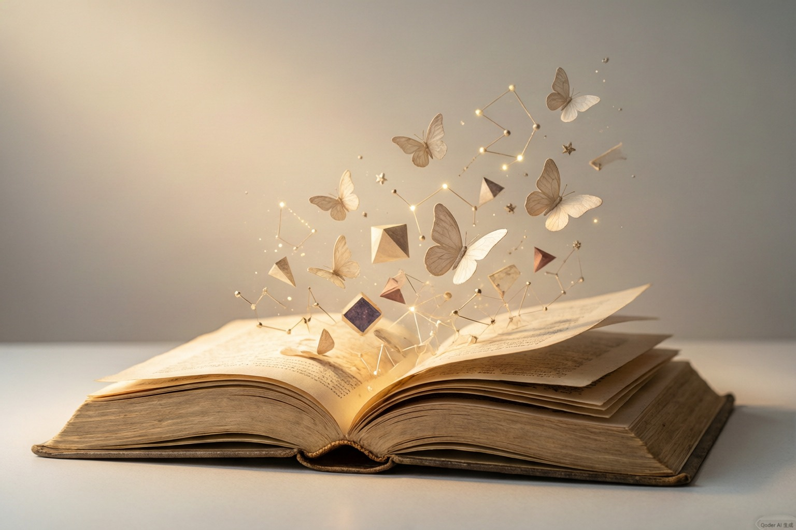

## 一

二十五年前，我到农村去插队时，带了几本书，其中一本是奥维德的《变形记》，我们队里的人把它翻了又翻，看了又看，以致它像一卷海带的样子。后来别队的人把它借走了，以后我又在几个不同的地方见到了它，它的样子越来越糟。我相信这本书最后是被人看没了的。现在我还忘不了那本书的惨状。插队的生活是艰苦的，吃不饱，水土不服，很多人得了病，但是最大的痛苦是没有书看，倘若可看的书很多的话，《变形记》也不会这样悲惨地消失了。除此之外，还得不到思想的乐趣。我相信这不是我一个人的经历：傍晚时分，你坐在屋檐下，看着天慢慢地黑下去，心里寂寞而凄凉，感到自己的生命被剥夺了。当时我是个年轻人，但我害怕这样生活下去，衰老下去。在我看来，这是比死亡更可怕的事。

## 二

"文化革命"之后，我读到了徐迟先生写哥德巴赫猜想的报告文学，那篇文章写得很浪漫。一个人写自己不懂得的事就容易这样浪漫。我个人认为，对于一个学者来说，能够和同行交流，是一种起码的乐趣。陈景润先生一个人在小房子里证数学题时，很需要有些国外的数学期刊可看，还需要有机会和数学界的同仁谈谈。但他没有，所以他未必是幸福的，当然他比没定理可证的人要快活。把一个定理证了十几年，就算证出时有绝大的乐趣，也不能平衡。但是在寂寞里枯坐就更加难熬。假如插队时，我懂得数论，必然会有陈先生的举动，而且就是最后什么都证不出也不后悔；但那个故事肯定比徐先生作品里描写的悲惨。然而，某个人被剥夺了学习、交流、建树这三种快乐，仍然不能得到我最大的同情。这种同情我为那些被剥夺了"有趣"的人保留着。

## 三

有必要对人类思维的器官（头脑）进行"灌输"的想法，时下正方兴未艾。我认为脑子是感知至高幸福的器官，把功利的想法施加在它上面，是可疑之举。有一些人说它是进行竞争的工具，所以人就该在出世之前学会说话，在三岁之前背诵唐诗。假如这样来使用它，那么它还能获得什么幸福，实在堪虞。知识虽然可以带来幸福，但假如把它压缩成药丸子灌下去，就丧失了乐趣。当然，如果有人乐意这样来对待自己的孩子，那不是我能管的事，我只是对孩子表示同情而已。还有人认为，头脑是表示自己是个好人的工具，为此必须学会背诵一批格言、教条——事实上，这是希望使自己看上去比实际上要好，十足虚伪。这使我感到了某种程度的痛苦，但还不是不能忍受的。最大的痛苦莫过于总有人想要用种种理由消灭幸福所需要的参差多态。这些人想要这样做，最重要的理由是道德；说得更确切些，是出于功利方面的考虑。因此他们就把思想分门别类，分出好的和坏的，但所用的标准很是可疑。他们认为，假如人们脑子里灌满了好的东西，天下就会太平。因此他们准备用当年军代表对待我们的态度，来对待年轻人。假如说，思想是人类生活的主要方面，那么，出于功利的动机去改变人的思想，正如为了某个人的幸福把他杀掉一样，言之不能成理。

## 四

假如要我举出一生最善良的时刻，那我就要举出刚当知青时，当时我一心想要解放全人类，丝毫也没有想到自己。同时我也要承认，当时我愚蠢得很，所以不仅没干成什么事情，反而染上了一身病，丢盔卸甲地逃回城里。现在我认为，愚蠢是一种极大的痛苦；降低人类的智能，乃是一种最大的罪孽。所以，以愚蠢教人，那是善良的人所能犯下的最严重的罪孽。从这个意义上说，我们决不可对善人放松警惕。假设我被大奸大恶之徒所骗，心理还能平衡；而被善良的低智人所骗，我就不能原谅自己。

## 五

我虽然已活到了不惑之年，但还常常为一件事感到疑惑：为什么有很多人总是这样的仇恨新奇，仇恨有趣。古人曾说：天不生仲尼，万古长如夜。但我有相反的想法。假设历史上曾有一位大智者，一下发现了一切新奇、一切有趣，发现了终极真理，根绝了一切发现的可能性，我就情愿到该智者以前的年代去生活，这是因为，假如这种终极真理已经被发现，人类所能做的事就只剩下了依据这种真理来做价值判断。从汉代以后到近代，中国人就是这么生活的。我对这样的生活一点都不喜欢。
